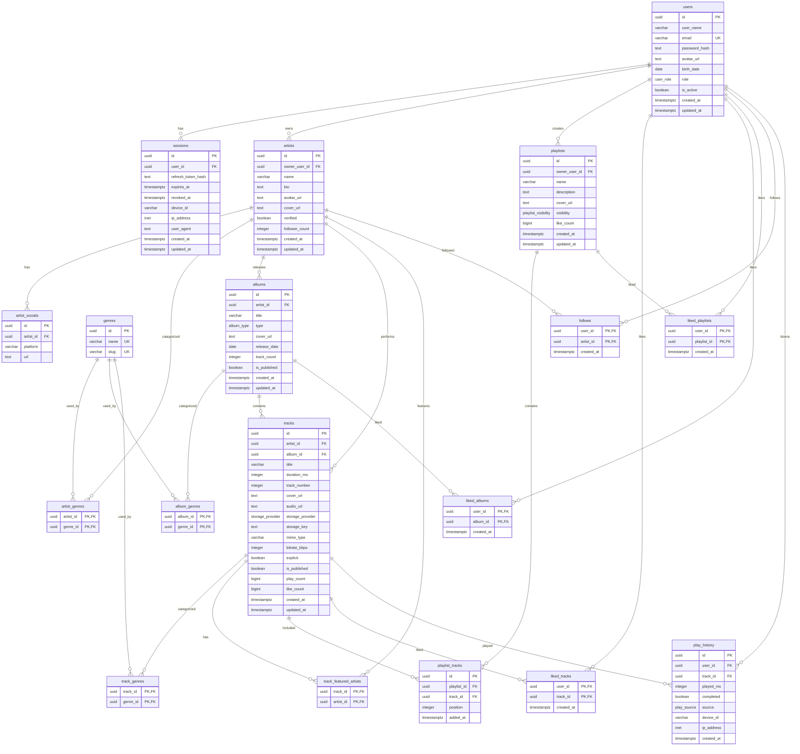

# PostgreSQL Database Diagram

Энэ ERD нь audio streaming Flutter app-ийн PostgreSQL хувилбарт зориулсан normalized database design юм.

## ER Diagram



## Enum төрлүүд

```sql
CREATE TYPE user_role AS ENUM ('listener', 'artist', 'admin');
CREATE TYPE album_type AS ENUM ('album', 'single', 'ep', 'compilation');
CREATE TYPE storage_provider AS ENUM ('url', 'local', 's3', 'gcs', 'cloudinary');
CREATE TYPE playlist_visibility AS ENUM ('private', 'public', 'unlisted');
CREATE TYPE play_source AS ENUM ('album', 'playlist', 'search', 'radio', 'direct');
```

## Гол constraint-үүд

```sql
-- Users
UNIQUE (email)

-- Genres
UNIQUE (name)
UNIQUE (slug)

-- Many-to-many duplicate protection
ALTER TABLE artist_genres ADD PRIMARY KEY (artist_id, genre_id);
ALTER TABLE album_genres ADD PRIMARY KEY (album_id, genre_id);
ALTER TABLE track_genres ADD PRIMARY KEY (track_id, genre_id);
ALTER TABLE track_featured_artists ADD PRIMARY KEY (track_id, artist_id);
ALTER TABLE liked_tracks ADD PRIMARY KEY (user_id, track_id);
ALTER TABLE liked_albums ADD PRIMARY KEY (user_id, album_id);
ALTER TABLE liked_playlists ADD PRIMARY KEY (user_id, playlist_id);
ALTER TABLE follows ADD PRIMARY KEY (user_id, artist_id);

-- playlist_tracks deliberately uses its own id primary key.
-- This allows the same track to appear more than once in one playlist.
ALTER TABLE playlist_tracks ADD PRIMARY KEY (id);
ALTER TABLE playlist_tracks ADD CONSTRAINT uq_playlist_tracks_position UNIQUE (playlist_id, position);
```

## Recommended indexes

```sql
CREATE INDEX idx_sessions_user_id ON sessions(user_id);
CREATE INDEX idx_sessions_expires_at ON sessions(expires_at);

CREATE INDEX idx_artists_name ON artists(name);
CREATE INDEX idx_albums_artist_id ON albums(artist_id);
CREATE INDEX idx_tracks_artist_id ON tracks(artist_id);
CREATE INDEX idx_tracks_album_id ON tracks(album_id);
CREATE INDEX idx_tracks_published_play_count ON tracks(is_published, play_count DESC);

CREATE INDEX idx_playlists_owner_user_id ON playlists(owner_user_id);
CREATE INDEX idx_playlist_tracks_playlist_position ON playlist_tracks(playlist_id, position);

CREATE INDEX idx_play_history_user_created ON play_history(user_id, created_at DESC);
CREATE INDEX idx_play_history_track_created ON play_history(track_id, created_at DESC);

-- Search-д зориулж PostgreSQL full text index ашиглаж болно.
CREATE INDEX idx_artists_search ON artists USING gin(to_tsvector('simple', name || ' ' || coalesce(bio, '')));
CREATE INDEX idx_albums_search ON albums USING gin(to_tsvector('simple', title));
CREATE INDEX idx_tracks_search ON tracks USING gin(to_tsvector('simple', title));
```

## Design notes

- MongoDB дээр байсан `genres: []` array-г PostgreSQL дээр `genres` + join table болгон салгасан.
- Like-ийг нэг polymorphic table болгохын оронд `liked_tracks`, `liked_albums`, `liked_playlists` гэж 3 table болгосон. Ингэснээр foreign key бүрэн ажиллана.
- `playlist_tracks` нь `id` primary key-тэй. Ингэснээр нэг playlist дотор нэг track-ийг олон удаа оруулах боломжтой.
- `playlist_tracks.position` нь playlist доторх track order-ийг хадгална. `(playlist_id, position)` unique constraint нь нэг playlist дотор position давхцахаас хамгаална.
- `tracks.duration_ms` нь frontend audio player болон `play_history.played_ms`-тэй ижил миллисекунд нэгж ашиглана.
- `tracks.audio_url`, `storage_provider`, `storage_key` нь upload/stream flow-д ашиглагдана.
- `sessions.refresh_token_hash` нь refresh token-ийг plain text хадгалахгүй байх security design.
